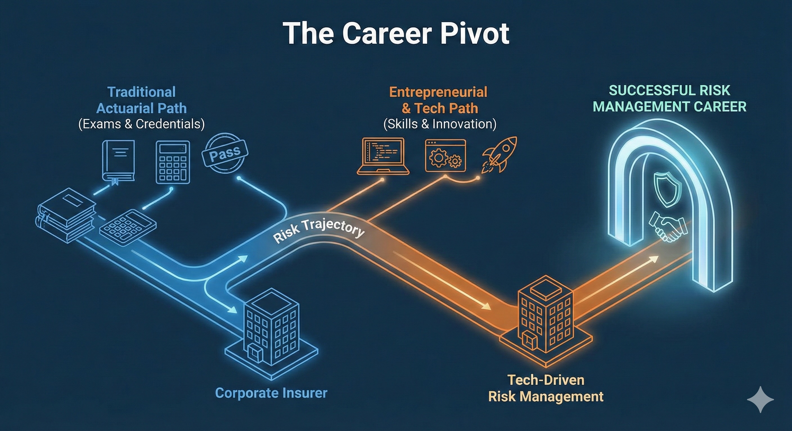
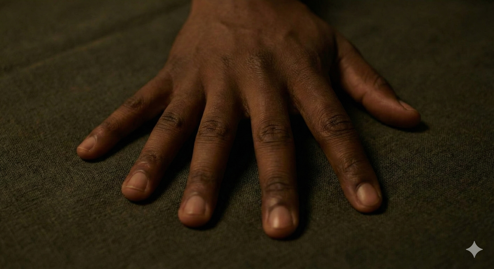
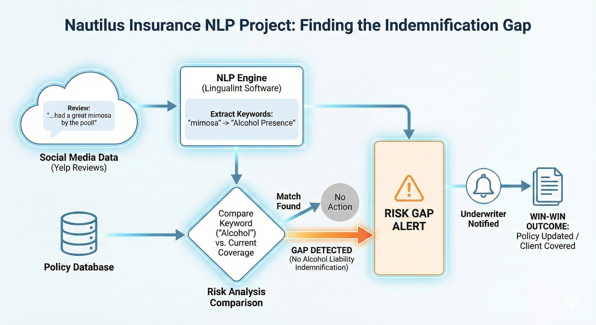
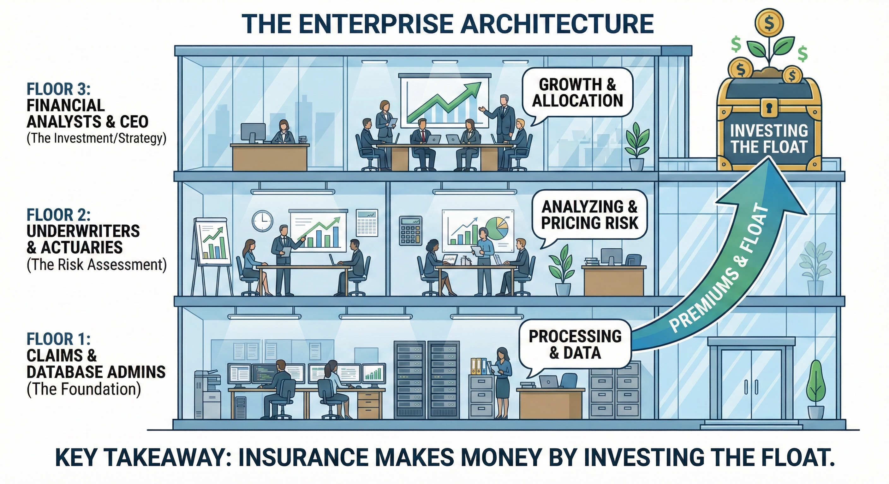
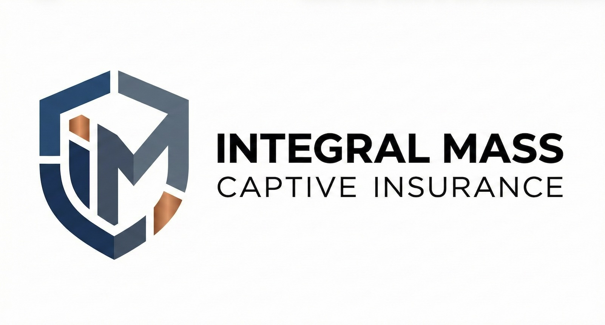

# The Big Trust
## What Was - Is For What Will Be

**A Founder's Journey: From Risk Runners to Risk Management**

*Presented to the Risk Runners Club, University of Arizona*
*February 17, 2026*

---

# The Elephant in the Room

**I founded this club, but I never passed an actuarial exam.**

* **The Reality:** I oriented my entire life toward actuarial science, but the path wasn't linear.
* **The Outcome:** Orienting toward this discipline changed my life, even without the credentials.
* **The Goal Today:** To share the "Big Trust"—how understanding the architecture of risk can build a career, whether you pass the exams or not.

---

# Origins: 10 Fingers vs. 100,000

Before the math, there was **Language & Code**.

* **2015:** Wrote a book on AI Philosophy.
* **The Tech:** Created [LinguaLint](https://lingualint.com) (Natural Language Processing).
    * Scraped 1,500 news articles/day.
    * Extracted event codes to predict stock market trends.
* **The Realization:** It was a "lightweight LLM middleware."
    * *My 10 fingers* coding from scratch vs. the *100,000 fingers* that built ChatGPT.
* **The Shift:** Moved from UC Davis (Ag) $\to$ Poetry $\to$ U of A (Math/Finance) to find something "eternal" amidst rapid tech changes.

---

# The Educational Crossroads
**Why U of A?**

* **The Choice:** ASU (Established Actuarial Program) vs. U of A (College Town Culture).
* **The Gap:** ASU had the funding, the WSIA events, and the Casualty Actuarial Society (CAS) connection. U of A did not.
* **The Solution:** Founded **Risk Runners**.
    * Bridging the gap.
    * Driving students to WSIA events.
    * Creating a community from scratch (0 to 1).

---

# The Overload & The Hubris

I tried to do it all at once:
1.  Math Degree (PDEs, Stochastic Processes).
2.  Finance Program (Eller).
3.  Running a Tech Company (Sensutec).
4.  Latin & Systems Engineering.
5.  **Running the Risk Runners Club.**
6.  Exercise
7.  Night Life

**The Result:** I took the Financial Math exam to "see how hard it was." **I failed.**
*But in failing the exam, I got to see the bigger picture.*

---
# The Actuarial Internship: Nautilus Insurance

<small>*Thanks to Brent Carr @ Nautilus / Connection via WSIA*</small>

I applied my NLP software to the insurance world.

* **The Project:** Scraping Yelp reviews for hotel/motels.
* **The Insight:** "Great mimosa!" + No alcohol indemnification = **Risk Gap.**
* **The Win-Win-Win:**
    1. **Underwriter:** Knows the risk before the lawyers do.
    2. **Insurer:** Gets higher premiums for proper coverage.
    3. **Client:** Is actually covered for their reality.

---

# The Enterprise Architecture
*What I learned inside the building.*

Insurance isn't just math; it's a physical structure of talent.

* **Floor 1:** Claims & Database Admins (The Foundation).
* **Floor 2:** Underwriters & Actuaries (The Risk Assessment).
* **Floor 3:** Financial Analysts & CEO (The Investment/Strategy).

**Key Takeaway:** Insurance doesn't make money solely on premiums; it makes money by **investing the float**.

---

# The Vision: A Tale of Two Societies
*What Was - Is For What Will Be*

I proposed a new model for Arizona education based on the two main societies:

| **CAS (Casualty)** | **SOA (Society of Actuaries)** |
| :--- | :--- |
| **Focus:** Property/Product | **Focus:** Health/Life |
| **Risk:** Before/After Lifecycle | **Risk:** During Lifecycle |
| **Analogy:** The Lawyer | **Analogy:** The Doctor |
| **School:** ASU (State School) | **School:** U of A (University) |

*Goal: Give high schoolers a clear choice of path, just like choosing between Med School and Law School.*

---

# Career Trajectory: The Pivot
*Post-2020: Adapting to the World*

**1. CPG Analytics (Remote Work)**
* Started with simple tools.
* Mastered **Tableau** (Business Intelligence).
* *Action:* Taught others how to use Kaggle data + AI to build portfolios.

**2. Veteran Affairs (Contractor)**
* **Patient Generated Health Data (PGHD).**
* Wearables (Fitbit, Dexcom) predicting health risks.
* *The Actuarial Link:* Using continuous IoT data to predict insurance risk (Life/Health).

---

# Current Frontier: Captive Insurance
*Merging Housing & Risk*

My market research led me to the housing crisis and **Prefab Manufacturing**.

* **The Strategy:** Applying the "Insurance Building" model to a smaller scale.
* **Captive Insurance:**
    * Like 12 doctors self-insuring to pool risk.
    * Capturing the premium + Investing the float.
* **The Focus:** [Captive Management for Prefab Manufacturers](https://captive.integralmass.com).

---

# What I Value (vs. Advice)

**Academia vs. Industry**
* **Academia:** Can trap you in a cycle of paying for credentials.
* **Industry:** Pays you for your time and values **work experience** and **tool mastery** (tech stack) over pure theory.

**Work-Life Balance**
* I value leaving work at work.
* Time for: Hiking, Poetry, Pickleball, Networking.
* *We work to live, we don't live to work.*

---

# Resources & Community
*Where to look next*

*  **AI Trailblazers:**
    * *Aaron Eden & Maria Eden.*
    * Bridging the gap between AI-literate and non-literate.
    * Training mentors to train apprentices.
*  **Casualty Actuaries of the Desert States.**
*  **Arizona Captive Insurance Association (AZCIA).**
*  **Venture Café in Phoenix.**

*Networking is critical.*

---

# The Final Thought

**"What was - is for what will be."**

I may go back and take those first two exams because they open doors. But my journey taught me that **Risk Management** is broader than just a test score.

It's about:
* Networking
* Technology
* Trust (In your path)

**Thank you**
Jefferson Richards
jefferson@richards.plus
Socialize - [jefferson.cloud](https://www.jefferson.cloud)
Decode - [richards.systems](https://www.richards.systems)
Consult - [richards.plus](https://www.richards.plus)