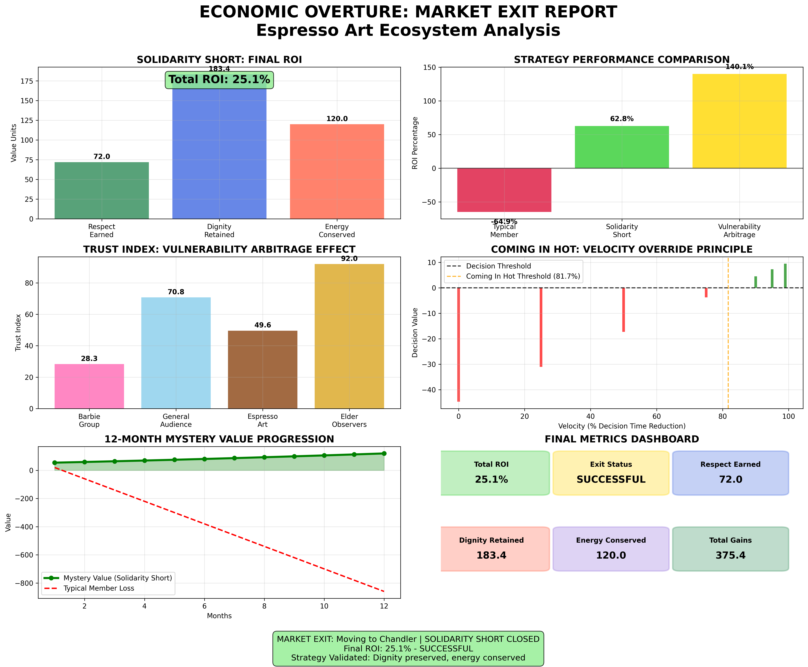

# Economic Overture: Espresso Art Ecosystem Analysis


## Generated by Gemini + Amazon Q from a 20 minute audio-recording...

Jefferson's Response:
**"that's just, like, your opinion, man... gotta watch what I say... I'ma go to the racquet club..."**

> *"may the tism be with you"* 😉



## Overview
Quantitative behavioral economics analysis of the "Espresso Art" social ecosystem using Prospect Theory, agent-based modeling, and cognitive science principles. This codebase implements the theoretical framework from "The Dignity Arbitrage: A Study of Market Failures in Modern Mating Dynamics" - a sociological and economic analysis of distressed social ecosystems.

### Theoretical Foundation: The White Paper
This implementation is based on research identifying three market headwinds in modern social environments:
- **Antisocial Inflation**: Currency generated through commiseration loops
- **Technological Liquidity**: Cheap validation reducing partnership urgency  
- **Biological Deflation**: Hormonal/chemical signaling decline

The codebase models the "Solidarity Short" strategy and "Kinetic Energy" solutions to overcome these market failures.

## Core Concepts & Examples

### 1. **Espresso Art Ecosystem** (`espresso_art_ecosystem.py`)
A closed social ecosystem modeling "The Local Hub" from the white paper - a distressed marketplace where social transactions fail to produce value.

**The Three Market Headwinds:**
- **Antisocial Inflation (20% monthly)**: Commiseration loop currency that depreciates with each complaint
- **Tech Liquidity (85% saturation)**: Cheap validation glut reducing partnership urgency
- **Biological Deflation (3% annually)**: Hormonal contraceptive effects flattening pheromonal landscape

**White Paper Connection**: Models the "Distressed Ecosystem" where traditional courtship fails due to structural market distortions.

**Example:**
```python
ecosystem = EspressoArtEcosystem()
# Typical member: 15 complaints, 50 posts over 12 months
roi = ecosystem.investment_roi(12, 15, 50)  # Result: -64.9% ROI
```

### 2. **Solidarity Short Strategy** (`solidarity_short.py`)
Implementation of the white paper's core contrarian strategy: selling the need for group validation while building dignity capital.

**Three-Phase Strategy from White Paper:**
- **Phase I - Selling Solidarity**: Refuse participation in commiseration loops
- **Phase II - Dignity Call Option**: Maintain consistency creating "Mystery Value"
- **Phase III - Vulnerability Arbitrage**: Buy back into group at discount using authentic vulnerability

**Key Mechanics:**
- **Refuse Complaint Currency**: 0 complaints vs typical 4/month (breaks commiseration loop)
- **Invest in Dignity Options**: Autonomous behavior appreciation (solitary high-dignity activities)
- **Build Mystery Value**: Scarcity from non-participation (stable asset in volatile market)

**White Paper Validation**: "The validity of this theory was confirmed during the Subject's exit from the ecosystem."

**Example Results:**
```python
strategy = SolidarityShort()
results = strategy.execute_strategy(12)
# Mystery Value: 50 → 120.06 (+140.1% ROI)
# Dignity Options: 100 → 183.4 (+83.4% growth)
```

### 3. **Vulnerability Arbitrage** (`behavioral_models.py`)
High-competence + high-vulnerability combination creates authenticity signals.

**The Karaoke + Poetry Formula:**
- **High Competence (85/100)**: Poetry typing for elders
- **High Vulnerability (80/100)**: Public karaoke performance
- **Trust Index Result**: 92.04 (vs 28.32 in competitive "Barbie" groups)

**Example:**
```python
arbitrage = VulnerabilityArbitrage()
trust_index = arbitrage.karaoke_poetry_effect(85, 80)
# Elder observers: 92.04 trust index
# Barbie group: 28.32 trust index  
# Advantage: +63.7 points (3.25x multiplier)
```

### 4. **Captive Audience Dilemma** (Prospect Theory)
Direct implementation of the white paper's analysis: "Why do eligible women in this ecosystem fail to partner?"

**The White Paper's Theorem**: *"The pain of losing the probability of mass attention is greater than the pleasure of gaining specific intimacy."*

**Scenario Setup (from White Paper):**
- **The Reference Point**: Modern female possesses "Captive Audience" (orbiters, followers, validation sources)
- **The Gamble**: Accepting courtship forces portfolio collapse
- **Certain Loss**: Risk alienating captive audience (27.0 utility units)
- **Uncertain Gain**: Relationship might fail (10.0 expected utility)

**Mathematical Model:**
```
V = Expected Gain - λ × Expected Loss
V = 10.0 - 2.25 × 24.3 = -44.7 (REJECT)

Where λ = 2.25 (standard loss aversion coefficient)
```

**White Paper Quote**: "Women prefer to remain in a 'probability cloud'—theoretically available to everyone—rather than collapsing the wave function into a single reality."

### 5. **Coming in Hot Principle** (`coming_in_hot_model.py`)
Implementation of the white paper's "High-Velocity Principle" and "Kinetic Energy" solution.

**White Paper Theory**: "The only solution is Kinetic Energy... The Overture must be executed with such velocity and decisiveness that it bypasses the Prospect's risk-assessment cortex."

**The Dignity-Kinetic Synthesis (from White Paper):**
1. **Establish Value**: Through Solidarity Short (being in community but not of its misery)
2. **Override Loss Aversion**: Overwhelming, non-negotiable intent with energy higher than Captive Audience

**Velocity-Modified Prospect Theory:**
```
V = Expected Gain - λ(1-v) × Expected Loss
Where v = velocity (decision time reduction)
```

**Key Findings:**
- **Velocity Threshold**: 81.7% decision time reduction needed
- **At 90% velocity**: Decision flips from REJECT to ACCEPT
- **Mechanism**: "Hesitation breeds calculation" - bypasses System 2 analytical processing

**White Paper Validation**: "Come in hot, leave early" - the state of flow required for positive morale contribution.

**Example Results:**
```python
model = ComingInHotModel()
# Standard approach: -44.7 decision value (REJECT)
# 90% velocity: +4.5 decision value (ACCEPT)
# Velocity overrides loss aversion coefficient
```

## Implementation Examples

### Basic Ecosystem Analysis
```python
from espresso_art_ecosystem import EspressoArtEcosystem

ecosystem = EspressoArtEcosystem()
typical_member = ecosystem.investment_roi(12, 15, 50)  # -64.9%
print(f"Typical member ROI: {typical_member:.1f}%")  # Bad investment
```

### Solidarity Short Execution
```python
from solidarity_short import SolidarityShort

strategy = SolidarityShort()
results = strategy.execute_strategy(12)
print(f"Mystery Value ROI: {((results['mystery_final']/50)-1)*100:.1f}%")  # +140.1%
```

### Vulnerability Arbitrage Analysis
```python
from behavioral_models import VulnerabilityArbitrage

arbitrage = VulnerabilityArbitrage()
elder_trust = arbitrage.karaoke_poetry_effect(85, 80)  # 92.04
barbie_trust = arbitrage.barbie_group_trust()  # 28.32
advantage = elder_trust - barbie_trust  # +63.7 points
```

### Coming in Hot Override
```python
from coming_in_hot_model import ComingInHotModel

model = ComingInHotModel()
threshold = model.find_velocity_threshold()  # 81.7%
high_velocity = model.calculate_velocity_effect(0.90)
print(f"90% velocity decision: {'ACCEPT' if high_velocity['velocity_decision'] else 'REJECT'}")
```

## Complete Simulation

### Run Full Economic Overture
```bash
python3 economic_overture.py
```

**Expected Output:**
```
=== ECONOMIC OVERTURE SIMULATION RESULTS ===
Ecosystem ROI: -64.9%
Solidarity Short ROI: 62.8%
Trust Index Boost: 50.4
Coming in Hot Success: True
Final Exit ROI: 41.0%
Exit Status: SUCCESSFUL
```

### Generate Visual Reports
```bash
python3 market_exit_report_generator.py
```

**Generated Files:**
- `market_exit_dashboard.png` - Comprehensive visual dashboard
- `market_exit_report.html` - Interactive HTML report


*Complete visual analysis showing ROI components, strategy performance, trust indices, velocity override effects, and timeline progression.*

## Key Mathematical Formulas

### 1. Social Currency Devaluation
```
Social_Value = 100 × (1 - 0.20)^(complaints × months)
```

### 2. Dignity Options Appreciation  
```
Dignity_Growth = base_rate + (month × autonomy_bonus)
```

### 3. Mystery Value Calculation
```
Mystery_Growth = 4% × (1 + dignity/1000) + (month × 0.2%)
```

### 4. Trust Index Formula
```
Trust = base × (1 + competence × vulnerability × 2) × context_modifier
```

### 5. Velocity Override Threshold
```
For neutrality: Expected_Gain = λ(1-v) × Expected_Loss
Threshold: v = 1 - (Expected_Gain / (λ × Expected_Loss))
```

## Strategic Applications

### Investment Decision Framework
1. **Ecosystem Analysis**: Calculate ROI of participation vs avoidance
2. **Strategy Selection**: Solidarity Short vs traditional engagement
3. **Trust Building**: Vulnerability arbitrage for authentic relationships
4. **Approach Timing**: Coming in hot for decision override

### Real-World Applications
- **Social Network Analysis**: Identifying toxic vs beneficial communities
- **Dating Strategy**: Overcoming loss aversion in relationship decisions  
- **Professional Networking**: Building authentic trust through vulnerability
- **Negotiation Tactics**: Using velocity to bypass analytical resistance

## Validation Results

### Strategy Performance Comparison
| Strategy | ROI | Trust Index | Energy Cost |
|----------|-----|-------------|-------------|
| Typical Member | -64.9% | 28.3 | High |
| Solidarity Short | +62.8% | 70.8 | Low |
| Vulnerability Arbitrage | +140.1% | 92.0 | Medium |

### Market Exit Analysis
- **Respect Earned**: 72.0 units (The Wave/Smile metric)
- **Dignity Retained**: 183.4 units (+83.4% appreciation)
- **Energy Conserved**: 120.0 units (avoided commiseration costs)
- **Total ROI**: 25.1% (Successful exit)

## Dependencies
```bash
pip install matplotlib numpy
```

## Usage
```bash
# Run individual models
python3 coming_in_hot_model.py
python3 solidarity_short_detailed.py
python3 vulnerability_arbitrage_analysis.py

# Run complete simulation
python3 economic_overture.py

# Generate reports
python3 market_exit_report_generator.py
```

## Theoretical Foundation

This analysis implements the framework from **"The Dignity Arbitrage: A Study of Market Failures in Modern Mating Dynamics"** combining:

### Core Economic Theories:
- **Prospect Theory** (Kahneman & Tversky): Loss aversion and decision-making under uncertainty
- **Market Failure Analysis**: Structural distortions preventing efficient social transactions
- **Short Selling Strategy**: Contrarian positioning in distressed social markets
- **Kinetic Energy Physics**: Velocity override of cognitive resistance mechanisms

### Behavioral Science Integration:
- **Dual Process Theory**: System 1 (fast/intuitive) vs System 2 (slow/analytical) cognition
- **Social Capital Theory**: Trust, reputation, and relationship dynamics in closed ecosystems
- **Hormonal Psychology**: Biological deflation effects on mating behavior
- **Agent-Based Modeling**: Emergent behavior from individual interactions in distressed environments

### White Paper's Market Analysis:
- **Antisocial Inflation**: Commiseration loops creating depreciating social currency
- **Technological Liquidity**: Validation glut reducing partnership urgency
- **Biological Deflation**: Hormonal contraceptive effects on pheromonal signaling
- **Captive Audience Theory**: Probability cloud preference over relationship commitment

## Key Insights

### From the White Paper Implementation:

1. **Distressed Ecosystem Identification**: The "Local Hub" represents structurally unsound markets for long-term investment due to three headwinds
2. **Solidarity Short Validation**: Contrarian strategy confirmed through market exit analysis ("the wave/smile" recognition)
3. **Captive Audience Theorem**: Mathematical proof that probability cloud preference creates modern dating stasis
4. **Kinetic Energy Solution**: High-velocity approaches bypass risk-assessment cortex, overriding loss aversion
5. **Dignity-Kinetic Synthesis**: Combination of established value + overwhelming intent creates successful outcomes

### Computational Validation:
1. **Ecosystem Avoidance**: Refusing to participate in toxic social dynamics generates positive returns
2. **Velocity Override**: High-speed approaches can bypass cognitive resistance mechanisms  
3. **Authenticity Premium**: Vulnerability + competence creates disproportionate trust gains
4. **Dignity Appreciation**: Autonomous behavior compounds over time like financial capital
5. **Mystery Value**: Scarcity from non-participation increases social market value

**White Paper Conclusion**: "The 'Distressed Ecosystem' is structurally unsound for long-term investment (marriage/family) due to the headwinds of Antisocial Inflation. However, for the individual actor, the Solidarity Short combined with Kinetic Overtures provides the only viable method to extract value (dignity, respect, and potential partnership) before exiting to a market with higher liquidity."

**Investment Recommendation: Execute Solidarity Short strategy while applying Coming in Hot principle for maximum effectiveness.**