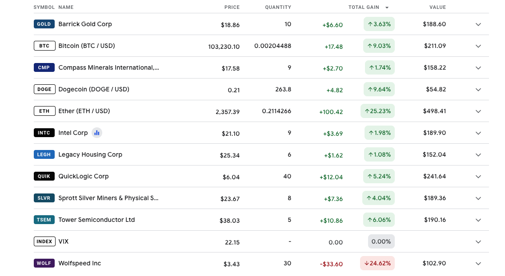
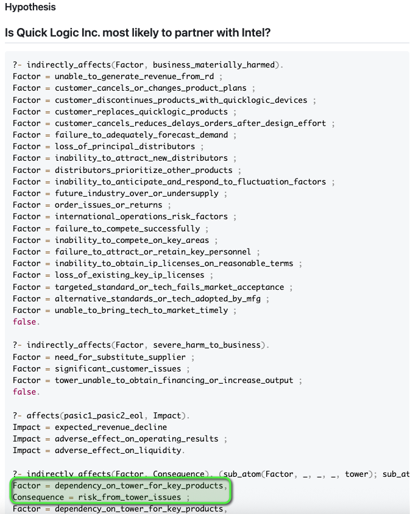

### 2025-05-09

# The Long Con

## Approach

My approach into running the risks for semiconductors was to speculate that the Taiwan Blockade will happen by October 21st, 2025. I now understand that China does the long con. I am speculating that the threat of a Taiwan Blockade is driving semiconductor market movements (e.g. WOLFspeed), and that China is encouraging market development of semiconductor tech so that they may steal the tech Intellectual Property. In a sense, the blockade isn't necessary, and the "planned conflict" will be baked into the price, if semiconductors were a tradeable commodity.

## Formation

I used the "Green Lumber Fallacy" to bet in the short-term, and pulled out within one week, as the weight of this speculative account needs to be more speculative than the "Short Term Votes" of [semiconductors](./semiconductors/), [housing](./housing/), [oil](./oil/), ... I learned about crypto currency being right-bound, relative to how crypto is maintained and utilized. I now know that weight is what drives the long-term.




### Execution

- I was encouraged by seeing all green for the short-term votes, seeing that my head was in the right space
- I am using the "dumbbell" approach to look for IPOs in semiconductors (WOLFspeed vs Photonic), healthcare wearable devices, and telecom supported AI.
- I am scheduling a once a week look - in that I know the day trade is exhausting
- I now have a homemade risk analysis method for analyzing risk factors
    * This method involves extracting the predicate calculus from my [RiskRunners.com](https://riskrunners.com) website, and generating queryable scripts
        - 
- I am not interested in QUIK or TSEM, because of the export difficulties from Israel (QUIK depends on TSEM, as seen through [the 10k](https://riskrunners.com/QUICKLOGICCORPORATION.html))
    * They are driving the Intellectual Development, more so than the manufacturing mass


### 2025-05-05
# Lean Dream

## The actual dream

is AR glasses allowing us to do Legend of Zelda style adventures in the national parks; as well as, discovering nature to then collect the magic-wanded CAD files.

## The pitfall

is spending too much RAM on the retrospective covariance equation on a timelapse of historical porfolios + stochastic simulations

## The takeaway of the pitfall

is the derivation of the Black-Scholes equation is the history of mathematics in a nutshell - indicating that financial markets in perfectly-efficient information systems are actually very predictable; yet, we are in a semi-efficient information system; such that, private information is what moves the market most of all.

## The antifragile approach

Utilizing my [RiskRunners.com](https://riskrunners.com), without numerical financial data, is an optimum approach for my purposes. It took time and the availability of LLMs to make possible the generation and utilization of predicate calculus - applied to public company risk factors.

## The formation

1. Choose an archetypal company
2. Process the risk factors into Prolog Scripts
3. Ask the LLM to generate insightful queries
4. Learn, think, create
5. Store documentation in corpus

## The integration

Utilizing a MCP with my AI [Cortext.io](https://cortext.io) (which generates the html pages on the Risk Runners website), to then generate prolog scripts and to finally document the predicate calculus in a wiki-type repository, is an ideal way to track our learned conditionals throughout the coming seasons. This aiming towards the Grand Arbiter... with applications in Insurance, Law, and Family [survitality](https://perrydime.com/survivtality.html)... I am, however, concerned that the insurance applications are right-bound in spirit and direction...

## The execution


This is the corpus of Prolog scripts and queries against the [extracted risks](../riskrunners.com/) from public company annual reports.

## Basic Prompt to Gemini 2.5 Pro

```sql
Generate a prolog script from the following risk factors

and provide a list of queries that would be insightful

[Paste Risk Factors from RiskRunners.com ...]

```

## Template for Summary Pages


### Date
## 
### Company
# 

## Takeaways
- 
- 
- 

### Hypothesis
## 


```sql

```