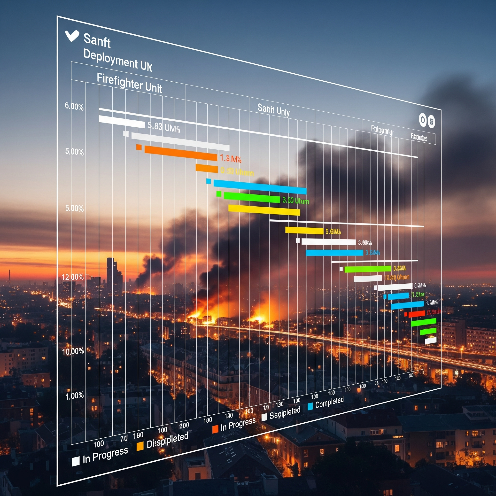

# **Ambient Gantt**
## Leveraging Ambient Biometrics and Morale Insights for Optimal Front-Line Deployment

**Presenter:** Jefferson Richards
**Date:** June 12, 2025
**Inspired by:** [Philips RATE Program](https://www.usa.philips.com/a-w/about/news/archive/standard/news/press/2024/philips-to-further-roll-out-rate-ai-for-early-infection-detection-at-us-department-of-defense-through-four-year-dollar-25-million-contract.html) & Current VA Project

---

### **1. The Human Factor: Why We're Here**

* **The Compelling Event:** There's a silver-lining from COVID: focused data pipeline dev towards predicting ONE health condition...
* **Today's Paradigm:** Manual schedules, self-reported fitness, subjective assessments.
* **The Hidden Threats:** Stress, fatigue, and nascent illness are invisible.
* **The Vision:** Proactively support our personnel with a real-time understanding of their well-being.

---

### **2. The Technology: Seeing the Invisible**

* **Patient-Generated Health Data (PGHD):** Data from wearables (watches, rings) and smart devices.
* **Ambient Tracking:** Passive, continuous monitoring of key biometrics.
    * **Sleep:** Quality, duration, disturbances.
    * **Respiratory Health:** Rate, heart rate variability (HRV), even airborne compounds to detect early signs of illness.
    * **Stress & Fatigue**

---

### **3. The Application: A "Readiness" Gantt Chart**

---

### **4. How an "Interchange" Works**

* **Alert:** Firefighter John Doe's data flags a high probability of a developing respiratory illness. His status turns **Red**.
* **Action:** The resource manager is alerted and seamlessly exchanges him with a **Green** status firefighter on standby.
* **Support:** John Doe is directed to health services for early intervention.

**The Result:** The crew is protected, the mission is fully staffed, and John receives care before his condition worsens.

---

### **5. The Fuzzy Area: Quantifying Morale**

* **Beyond Physical Health:** Low morale can precede burnout, errors, and risk.
* **Measuring the "Unmeasurable":**
    * Anonymous, brief pulse surveys (e.g., "Rate your morale today: 1-5").
    * Analyzing anonymized team-level sentiment.
    * Tracking engagement in peer support and training.
* **The Goal:** Not to punish, but to provide a **"psychological pit stop."**

---

### **6.1 The Ethical Minefield & The Path Forward**

* **Foundation of Trust is NON-NEGOTIABLE.**
    * **Data Privacy:** Anonymized, secure, and compliant with HIPAA, ADA, etc.
    * **Transparency & Consent:** Must be opt-in, with clear understanding of use.
    * **Governance:** A multi-stakeholder committee with union and ethics oversight.
* **This is a Support Tool, NOT a Surveillance Tool.**

---

### **6.2 The Ethical Minefield & The Path Forward**

* **Socioeconomic REALITY**
    * **Work Ethic:** Diverse work ethics should be considered.
    * **Sacrifice:** A single-mother nurse who is told she can't work?!
    * **Agency:** Free-will for the individual in civilian world.

---

### **7. Conclusion & Call to Action**

* **The Vision:** Empower our heroes with data-driven, proactive care.
* **The Choice:** Remain with the limitations of today or build the supportive, resilient future of tomorrow.
* **The Ask:** Brainstorm resource-allocation informed by biometrics for a **commercial** application.

---

# **Q&A**

## Thank You