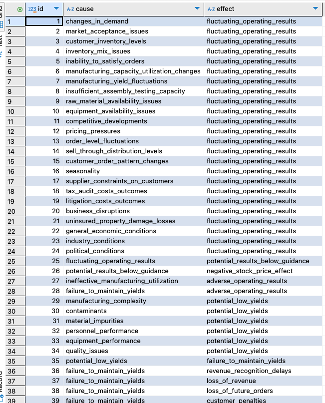

### 2025-03-12
# Prompting and Persisting the Predicates of Risk Factors

## Context

I have been generating the prolog based predicates of these risk factors...

## The pitfall

is the purely teleological (for what?) or the purely mechanistic (how?) mitigations/treatments of the risk factors.

# The integration of the pitfall

is generating the causes and the effects with a properly structured Prompt and in the proper techincal solution... prolog seems to be overkill, however it is more flexible in it's managmeent and querying of predicate relationships. This directory contains a Python script that uses NetworkX and Matplotlib to visualize the relationships. The ability to generate visuals, to persist to a database and to continue to interface with other libraries and ML, far surpasses the elegance of the isolated Prolog.

## The Finding

[Cortext.io](https://cortext.io) generated force-directed diagrams from risk factors has a lot of noise and is not nearly as precise as the LLM derived visual here... and with the potential for AR glasses to make sifting through this solar-system much better... I'm speechless:


## The Prompt


Please analyze the following natural language text, which describes risk factors for a company. Your goal is to extract all direct causal relationships mentioned.

Identify pairs of (Cause, Effect) where a 'Cause' is a specific condition, event, or factor that is stated to lead to or contribute to an 'Effect' (another condition, event, or outcome).

The output should be a structured list of these (Cause, Effect) pairs. Please format each cause and effect as a concise, snake_case string suitable for programmatic use (e.g., `changes_in_demand`, `fluctuating_operating_results`).

For example, if the text says "Declining customer interest could reduce sales," you should extract:
`('declining_customer_interest', 'reduced_sales')`

If the text says "Our reliance on a single supplier for component X makes us vulnerable to supply chain disruptions, which in turn can halt production," you should extract:
`('reliance_on_single_supplier_component_x', 'vulnerability_to_supply_chain_disruptions')`
`('vulnerability_to_supply_chain_disruptions', 'halt_production')`

Please provide the complete list of extracted pairs based on the text I will provide.

```Bash
```


## Generates

