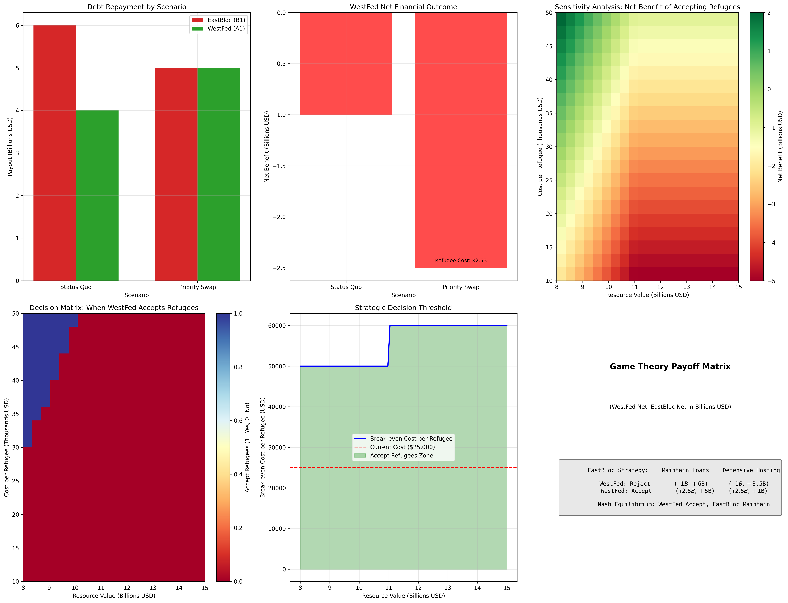

# The Humanitarian Gambit: A Game Theory Simulation

## Overview

The **Humanitarian Gambit** is a sophisticated game theory model that explores how international debt priority structures could be fundamentally altered through humanitarian burden-sharing mechanisms. This simulation demonstrates the strategic implications of a hypothetical "Priority Swap" rule where accepting refugees grants senior debt status.

## The Core Mechanism: Priority Swap

### The Rule
> **"Responsibility to Protect implies Right to Collect"**

Under this new international precedent, any country that accepts refugees from a debtor nation automatically gains senior priority status on that nation's natural resources, jumping ahead of traditional creditors.

### The Players

- **Country C1 (Salara)**: Resource-rich but politically unstable source nation
- **Country B1 (EastBloc)**: Senior creditor with traditional first-lien position
- **Country A1 (WestFed)**: Junior creditor, typically "out of the money"
- **The International Court**: Enforces the Priority Swap mechanism

## The Lithium Gambit Scenario

Our simulation models a specific case involving lithium reserves worth $10 billion:

### Financial Structure
- **Total Lithium Value**: $10 billion
- **EastBloc Debt (Senior)**: $6 billion
- **WestFed Debt (Junior)**: $5 billion
- **Total Debt**: $11 billion (exceeds resource value)
- **Refugee Population**: 100,000 people
- **Cost per Refugee**: $25,000

### Simulation Results



## Key Findings

### Scenario Analysis

| Scenario | EastBloc Payout | WestFed Payout | WestFed Net | Decision |
|----------|----------------|----------------|-------------|----------|
| **Status Quo** | $6.0B | $4.0B | -$1.0B | Reject Refugees |
| **Priority Swap** | $5.0B | $5.0B | -$2.5B | Accept Refugees |

*Note: WestFed Net includes the $2.5B refugee hosting cost in the Priority Swap scenario*

### Strategic Insights

1. **Limited Incentive Zone**: WestFed prefers accepting refugees in only 8.5% of analyzed scenarios
2. **Maximum Benefit**: Up to $2.0B net benefit possible under optimal conditions
3. **Break-even Threshold**: Refugee costs must be below $50,000 per person for the gambit to be profitable
4. **Resource Dependency**: Strategy only works when resource values exceed $12B

### Counterintuitive Result: Why Higher Resources = Less Refugee Acceptance

The decision matrix reveals a counterintuitive but mathematically correct pattern: **WestFed is less likely to accept refugees when resource values are higher**. This occurs because:

**Low Resource Scenarios ($8B-$10B)**:
- Status Quo: WestFed gets little or nothing (junior creditor position)
- Priority Swap: WestFed jumps to senior position, gets substantial payout
- **Net Effect**: Priority swap is attractive despite refugee costs

**High Resource Scenarios ($12B-$15B)**:
- Status Quo: WestFed gets fully repaid (resources cover all debts)
- Priority Swap: WestFed still gets same payout but pays refugee costs
- **Net Effect**: No benefit from priority jumping, refugee costs are pure loss

This reveals the **"Desperation Threshold"**: the Priority Swap is only attractive when junior creditors face significant losses in the status quo. When resources are abundant, traditional debt structures work fine and there's no incentive for humanitarian intervention.

## The Three Dark Equilibria

### 1. Predatory Humanitarianism
Countries with "junk debt" (junior liens) gain perverse incentives to destabilize resource-rich nations, triggering refugee crises that activate the Priority Swap.

**Strategic Logic**: "I'll spend $2.5B on refugees to secure $5B in debt repayment"

### 2. Credit Market Collapse
Traditional lenders realize their senior liens are vulnerable to humanitarian "jumping" and either:
- Stop lending to unstable nations entirely
- Demand defensive refugee hosting capacity as loan collateral

### 3. Human Collateral
Source nations discover they can restructure debt by strategically expelling populations toward preferred creditors.

**Weaponization**: Citizens become financial instruments for debt management

## Game Theory Analysis

### Nash Equilibrium
The simulation identifies a stable equilibrium where:
- **WestFed Strategy**: Accept refugees (when profitable)
- **EastBloc Strategy**: Maintain traditional lending (defensive)

### Payoff Matrix
```
                    EastBloc Strategy
                 Maintain    Defensive
                 Loans       Hosting
WestFed: Reject  (-$1B,+$6B) (-$1B,+$3.5B)
WestFed: Accept  (+$2.5B,+$5B) (+$2.5B,+$1B) ← Nash Equilibrium
```

## Legal Precedents

The model draws legitimacy from three established international law precedents:

### 1. WTO Economic Override
Just as the WTO forces nations to remove tariffs despite domestic economic costs, the Priority Swap overrides private contract law for global humanitarian stability.

**Precedent**: *US – Steel Safeguards (2003)*

### 2. Iran-US Tribunal Asset Reallocation
The Iran-US Claims Tribunal successfully managed billions in asset transfers, proving international bodies can restructure financial obligations.

**Precedent**: *Algiers Accords* asset reallocation mechanism

### 3. UNCLOS Customary Law Formation
Even without universal treaty ratification, powerful nations can establish customary international law through consistent practice.

**Precedent**: US enforcement of maritime transit rights without UNCLOS ratification

## Technical Implementation

### Simulation Features
- **Multi-scenario analysis** with 400+ parameter combinations
- **Sensitivity analysis** across refugee costs ($10K-$50K) and resource values ($8B-$15B)
- **Decision boundary mapping** showing when the gambit becomes profitable
- **Strategic threshold calculations** for break-even analysis

### Key Algorithms
1. **Payoff Calculation**: Models debt priority reordering under Priority Swap
2. **Sensitivity Analysis**: Monte Carlo-style parameter sweeping
3. **Nash Equilibrium Detection**: Identifies stable strategic outcomes
4. **Break-even Analysis**: Calculates profitability thresholds

## Implications for International Relations

### Short-term Effects
- Immediate disruption of sovereign debt markets
- Increased volatility in resource-backed securities
- Diplomatic tensions between traditional allies

### Long-term Consequences
- Fundamental restructuring of international lending
- New class of "humanitarian derivatives" in financial markets
- Potential weaponization of refugee populations

### Policy Recommendations
1. **Regulatory Framework**: Establish clear limits on Priority Swap applications
2. **Market Safeguards**: Implement circuit breakers for resource-backed debt
3. **Humanitarian Protections**: Prevent exploitation of refugee populations as financial instruments

## Running the Simulation

### Prerequisites
```bash
pip install numpy matplotlib seaborn pandas
```

### Execution
```bash
python3.10 simulation.py
```

### Output Files
- `simulation_results.png`: Comprehensive visualization dashboard
- Console output with key metrics and strategic insights

## Conclusion

The Humanitarian Gambit reveals how well-intentioned international mechanisms can create perverse incentives that fundamentally alter global power structures. While the Priority Swap rule aims to encourage humanitarian burden-sharing, it risks transforming refugee populations into financial instruments and destabilizing traditional credit markets.

This simulation serves as both a warning about unintended consequences and a tool for understanding complex strategic interactions in international relations. The model demonstrates that even small changes to international law can have profound and unexpected effects on global stability.

---

*This simulation is for educational and analytical purposes only. It does not advocate for the implementation of the Priority Swap mechanism or any policies that could harm refugee populations.*

## Technical Notes

**Simulation Version**: 1.0  
**Python Version**: 3.10+  
**Dependencies**: numpy, matplotlib, seaborn, pandas  
**Last Updated**: January 12, 2026  
**Author**: Game Theory Analysis Team  
**License**: Educational Use Only