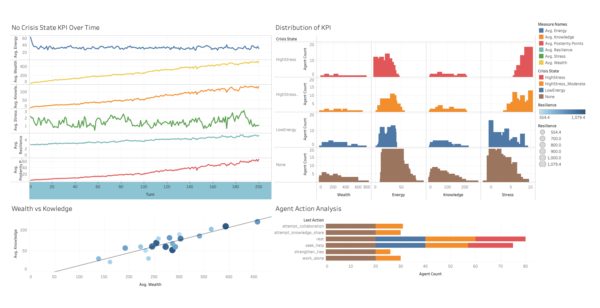

### 2025-05-25
# Shrodinger's Fish

Let's break down how we can reconcile Taleb's antifragility, mathematical models of change, social dynamics, and your simulation interests (Dark Campus, Sugarscape) to develop heuristics for a new simulation focused on value exchange, posterity, and risk management.

At the core, you're observing that various systems—be they quantum, financial, or social—exhibit **change and momentum**.

* **Covariance and Schrödinger's Equation:** As you noted, these are abstract models.
    * The **covariance** (or more broadly, the variance-covariance matrix in stochastic processes) helps us understand how different variables (or "particles" in your analogy) move together—their co-momentum and interdependencies. High covariance can indicate strong coupling, which can be a source of fragility if one component fails, or a source of synergistic strength.
    * **Schrödinger's equation** describes the evolution of a quantum system over time, essentially how the "energy" (Hamiltonian) dictates changes in the "state" (wave function), which relates to the probability of finding particles in certain configurations and thus their momentum.
    * Both hint at the idea that understanding the underlying dynamics of change and interaction is key to predicting or influencing future states.

* **Antifragility:** This is the property of systems that thrive and grow when exposed to volatility, randomness, disorder, and stressors, and love adventure, risk, and uncertainty. It's not just robustness (resisting shocks) but actively benefiting from them.
    * In your social context, "pruning peers" can be seen as an antifragile strategy: removing sources of negative volatility or "iatrogenics" (harm caused by the healer/helper) to strengthen the overall social "organism" aiming for posterity.
    * In an index, the retrospective calculation of fragility might involve looking at how individual contributors reacted to past stressors – did they break (fragile), resist (robust), or improve (antifragile)?

* **Dark Campus & Sugarscape:** These are agent-based models (ABMs).
    * **Sugarscape** models agents competing for limited resources ("sugar") on a landscape. Simple rules lead to complex emergent behaviors like migration, hibernation, and wealth distribution. It's a great laboratory for exploring how individual "playbooks" (e.g., "move to the cell with the most sugar") interact with environmental constraints and other agents.
    * **Dark Campus** (often associated with detecting "dark patterns" or negative/hidden influences) implies agents operating with incomplete information or encountering entities with non-transparent motives. This adds layers of risk and the need for more sophisticated "playbooks" to navigate.

## Reconciling and Generating Heuristics for a New Simulation

Let's aim for a simulation that models agents (individuals or small family units) operating within a social environment. The goal is to explore how self-imposed "playbooks" for value creation and rule-based risk management ("bylaws") contribute to individual and collective well-being ("wealthcare," "healthcare") and the ultimate aim of "raising children" or "passing on knowledge" (posterity).

Here's a conceptual framework and some heuristics:

**I. Core Concepts for the Simulation:**

1.  **Agents with Purpose:**
    * **Heuristic:** Agents are driven by a primary goal related to posterity (e.g., successfully "raising" offspring agents, accumulating "knowledge units" to pass on).
    * **Connection:** This aligns with your social pruning aimed at posterity.

2.  **Value Exchange & "Playbooks":**
    * **Heuristic:** Agents possess a "playbook" of actions they can take. These actions are known operations that are intended to provide value to others or to the agent itself.
    * **Examples of "Playbook" Actions:**
        * *Knowledge Sharing:* Teach a skill, share information (costs time/energy, potentially gains reputation/reciprocity).
        * *Resource Provision:* Create/gather a resource, offer a service (e.g., "babysitting" another agent's offspring, building a shared tool).
        * *Collaborative Project:* Engage in a joint activity that produces a larger benefit than individual efforts.
        * *Caregiving:* Actions that directly improve another agent's "healthcare" metric.
    * **Connection:** This is your "self-imposing a playbook for known operations that give value." The "value" can be explicitly defined (e.g., resource units, knowledge points, trust metrics).

3.  **"Wealthcare" & "Healthcare" Metrics (KPIs):**
    * **Heuristic:** Agents have measurable states of "wealth" and "health."
    * **"Wealthcare" KPIs:**
        * *Resource Stockpile:* (Analogous to Sugarscape's sugar). Could be generic "capital" or specific resources needed for playbook actions or child-rearing.
        * *Knowledge Capital:* Accumulated knowledge units.
        * *Social Capital/Reputation:* A metric reflecting trust, reliability, and past positive interactions. Influences others' willingness to engage.
        * *Infrastructure/Tools:* Assets that improve the efficiency of playbook actions.
    * **"Healthcare" KPIs:**
        * *Energy Level:* Decreases with action, stress; increases with rest, care.
        * *Stress Level:* Increases with negative interactions, resource scarcity, failed playbook actions, disease events.
        * *Resilience:* A metric that could be *antifragile* – potentially increasing after successfully overcoming a moderate stressor/challenge.
        * *Access to Support:* A measure of how many other agents are likely to provide aid if a "healthcare" crisis occurs.
    * **Connection:** These are the sensor-derived metrics indicating potential pathologies.

4.  **Bylaws / Rules Engine for Risk Management:**
    * **Heuristic:** The simulation environment (or individual agents through perception) has a "rules engine" that processes KPIs to identify risks and trigger consequences or alerts.
    * **Examples of "Bylaws":**
        * *Resource Depletion Threshold:* If an agent's "Resource Stockpile" drops below X, their "Stress Level" increases, and their ability to perform certain playbook actions is limited.
        * *Social Isolation Alert:* If an agent has minimal positive interactions over Y turns, a "Healthcare" risk is flagged (e.g., increased susceptibility to stress).
        * *Exploitation Detection:* If agent A consistently receives value from agent B without reciprocating (based on a moving average of value exchange), agent B (or the "system") might flag this, reducing B's willingness to interact with A or imposing a "reputation" penalty on A.
        * *Disease Propagation Model:* Simple SIR (Susceptible-Infected-Recovered) model triggered by low average "Healthcare" KPIs in a local neighborhood or random events.
    * **Connection:** Your "bylaws / a rules engine for the KPI or sensor-derived metrics that indicate risks."

5.  **Antifragility through Stressors and Adaptation:**
    * **Heuristic:** Introduce controlled stressors or random events. Agents' responses can lead to fragility, robustness, or antifragility.
    * **Mechanisms:**
        * *Playbook Evolution:* If a particular playbook action consistently fails or leads to negative outcomes under certain conditions, agents might "learn" to avoid it or try to develop new ones (perhaps by observing successful agents). This is a form of adaptation.
        * *Bylaw Adjustment (Advanced):* The "bylaws" themselves could evolve if the society consistently fails to manage certain risks.
        * *Post-Stress Growth:* An agent successfully overcoming a significant challenge (e.g., a resource shortage, a "disease" event by receiving community support) might see an increase in its "Resilience" metric or even "Social Capital."
        * *Information Cascade & Correction:* A false belief or inefficient "playbook" spreads (fragility). A critical event reveals the flaw, and agents who adapt quickly become more robust or even discover a better strategy (antifragility).
    * **Connection:** Moving beyond simple fragility calculations to how the *system and agents adapt* to stressors. The "pruning" of peers can be seen as a response to a social stressor (a non-value-adding relationship).

6.  **Social Pruning & Network Dynamics:**
    * **Heuristic:** Agents can choose to strengthen, weaken, or sever ties with other agents based on perceived value exchange, risk assessment (from bylaws), and alignment with posterity goals.
    * **Mechanism:**
        * Periodically, agents evaluate their connections.
        * If agent B consistently drains resources from agent A without contributing to A's "wealthcare," "healthcare," or posterity goals (as per A's internal assessment, possibly informed by the "bylaws engine"), A might reduce interaction frequency or "prune" the connection.
        * Conversely, mutually beneficial relationships are reinforced.
    * **Connection:** Directly models your current social pruning strategy.

**II. Heuristics for Agent Decision-Making (The "Tinkering" Logic):**

1.  **Perception & Situation Assessment:**
    * Agents perceive their own KPIs (health, wealth).
    * Agents perceive the KPIs of nearby/connected agents (to a limited extent, simulating imperfect information).
    * Agents are aware of active "bylaw" alerts relevant to them or their immediate network.

2.  **Goal Prioritization:**
    * If "Healthcare" is critical (e.g., very low energy), prioritize actions to restore it (rest, seek help).
    * If "Wealthcare" is critical (e.g., no resources for essential posterity actions), prioritize resource acquisition or value-generating playbook actions.
    * If basic needs are met, prioritize actions directly contributing to posterity (e.g., "educating offspring," collaborative projects that create lasting value).

3.  **"Playbook" Action Selection:**
    * **Expected Utility:** Agents might estimate the likely outcome of a playbook action (e.g., "If I share knowledge with Agent X, there's a P chance they will reciprocate with resource Y, improving my Wealthcare by Z and Social Capital by S").
    * **Risk Aversion/Seeking:** Agents could have different risk profiles. Some might prefer "safer" playbook actions with lower but more certain payoffs, while others (perhaps those with higher "Resilience" or in desperate situations) might try riskier, higher-reward actions.
    * **Social Influence:** Agents might be more likely to try playbook actions they've observed being successful for others, especially those with high "Social Capital."
    * **Antifragile Exploration (Advanced):** Occasionally, agents might "tinker" by trying a random or novel playbook action (or a variation of an existing one) even if its expected utility isn't the highest. This introduces variance and the potential for discovering better strategies (key to antifragility).

4.  **Interaction & Relationship Management:**
    * **Reciprocity Tracking:** Agents remember past interactions and their outcomes (at least with their direct connections).
    * **Trust-Based Decisions:** The willingness to engage in costly playbook actions with another agent depends on the "Social Capital" or trust level with that agent.
    * **Pruning Logic:**
        * If (Value Received from Agent X / Value Given to Agent X) < Threshold_Prune AND Agent X triggers "Risk Bylaws" frequently, THEN decrease interaction likelihood / sever connection.
        * If (Value Received from Agent X / Value Given to Agent X) > Threshold_Strengthen AND Agent X contributes to posterity goals, THEN increase interaction likelihood / strengthen connection.

5.  **Response to "Bylaw" Triggers:**
    * If a "Healthcare pathology" bylaw is triggered (e.g., high stress), the agent might:
        * Prioritize stress-reducing playbook actions.
        * Seek help from agents with high "Social Capital."
        * Temporarily disengage from risky or stressful activities.
    * If a "Wealthcare pathology" bylaw is triggered (e.g., resource depletion):
        * Prioritize resource-generating playbook actions.
        * Seek assistance or engage in collaborative resource acquisition.
        * Reduce non-essential expenditures.

**III. Connecting to Mathematical Abstractions:**

* **Covariance in Social Dynamics:** The "Social Capital" or relationship strength between agents can be seen as a dynamic covariance. If Agent A and Agent B have high positive social capital, their "fortunes" (in terms of achieving posterity goals) might be positively correlated. Negative interactions could create negative correlations. The "pruning" is an attempt to manage this covariance matrix – to decouple from negatively correlated or high-risk (high variance with negative outcomes) entities.
* **Energy & Momentum in Agent Actions:** An agent's "Energy Level" (Healthcare KPI) is like its potential energy. Executing a "playbook" action expends energy and creates "momentum" towards a goal (e.g., increased "Knowledge Capital," progress on a collaborative project). The efficiency of this energy-to-momentum conversion can be influenced by the agent's skills, tools, and the receptiveness of other agents.
* **System Evolution (Schrödinger-like):** While not a direct quantum analogy, the overall state of the simulated society (distribution of wealth, health, knowledge, social network structure) evolves over time based on the aggregate actions and interactions of agents, governed by their playbooks and the bylaws. The "rules engine" and the potential for playbook/bylaw evolution act like the "Hamiltonian" of the system, dictating how it changes. Antifragile systems would find "lower energy" (more stable and productive) states *through* perturbations, not just in spite of them.

**IV. Generating Your Simulation:**

1.  **Platform:** NetLogo is excellent for agent-based modeling and has features reminiscent of Sugarscape. Python with libraries like Mesa or even custom classes could also work.
2.  **Start Simple:**
    * Few agent types.
    * Simple "playbooks" (2-3 actions).
    * Basic KPIs (1-2 for wealth, 1-2 for health).
    * Rudimentary "bylaws" (e.g., if energy < X, must rest).
3.  **Iterate and Add Complexity:**
    * Introduce more nuanced playbook actions and value calculations.
    * Develop the "bylaws engine" with more sophisticated risk detection.
    * Implement social network dynamics and pruning.
    * Introduce random events and stressors (e.g., resource windfalls/shortages, "illness" events).
    * Experiment with mechanisms for playbook adaptation and learning (the antifragile component).
    * Visualize KPIs, network connections, and agent states to observe emergent behavior.

**Heuristic Example for a "Tinkering" Agent trying to pass on knowledge:**

* **Goal:** Maximize "Knowledge Offspring" (a metric for successful knowledge transfer).
* **KPIs:** Own `KnowledgeCapital`, `Energy`, `SocialCapital_with_TargetAgent`. TargetAgent's `LearningCapacity`.
* **Playbook Action: "Teach_Skill_X"**
    * *Cost:* `EnergyCost_Teach`, `TimeCost_Teach`.
    * *Pre-requisite:* Own `KnowledgeCapital` > `Skill_X_Requirement`.
    * *Risk (Bylaw check):* If `TargetAgent_StressLevel` > `High`, teaching effectiveness is reduced.
* **Decision Heuristic:**
    1.  Identify potential "student" agents (e.g., those with low `KnowledgeCapital` in Skill_X but high `LearningCapacity`).
    2.  Assess `SocialCapital_with_TargetAgent`. Higher is better.
    3.  Estimate success probability: `P_success = f(My_KnowledgeCapital, My_Energy, SocialCapital, TargetAgent_LearningCapacity, 1 - TargetAgent_StressLevel)`.
    4.  If `My_Energy > EnergyCost_Teach` AND `P_success > Threshold_Teach`:
        * Execute "Teach_Skill_X."
        * Outcome: `TargetAgent_KnowledgeCapital` increases by `Amount_Learned` (stochastic). `My_SocialCapital_with_TargetAgent` might increase. `My_Energy` decreases.
        * If teaching is successful (e.g., `TargetAgent_KnowledgeCapital` reaches a new plateau), `KnowledgeOffspring` metric might increment.
    5.  **Antifragile Tinkering:** Once every N turns, try teaching a less optimal student or a slightly different skill to gather more data on teaching effectiveness. If a surprising success occurs, update internal weights for `P_success` calculation.
    6.  **Pruning (related):** If repeated attempts to teach Agent Y fail despite good conditions, or if Agent Y is a "drain" in other ways, deprioritize Agent Y for future teaching.

By building layers of these heuristics, your agents will begin to navigate their social world, attempting to create value, manage risks, and strive for posterity in a way that can be observed, measured, and "tinkered with" – much like the processes you're exploring in your own life and studies. This framework should allow you to directly simulate the tensions and synergies between individual agency (self-imposed playbooks), societal rules (bylaws), and the emergent properties of complex adaptive systems, with an eye toward fostering antifragility.